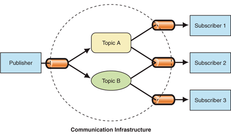
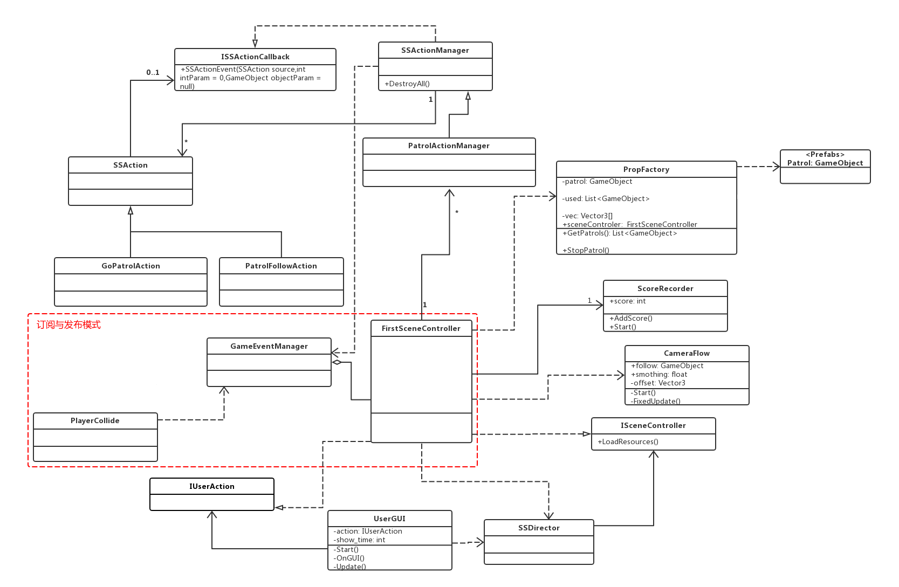

#### 智能巡逻兵

- 提交要求：
- 游戏设计要求：
  - 创建一个地图和若干巡逻兵(使用动画)；
  - 每个巡逻兵走一个3~5个边的凸多边型，位置数据是相对地址。即每次确定下一个目标位置，用自己当前位置为原点计算；
  - 巡逻兵碰撞到障碍物，则会自动选下一个点为目标；
  - 巡逻兵在设定范围内感知到玩家，会自动追击玩家；
  - 失去玩家目标后，继续巡逻；
  - 计分：玩家每次甩掉一个巡逻兵计一分，与巡逻兵碰撞游戏结束；
- 程序设计要求：
  - 必须使用订阅与发布模式传消息
    - subject：OnLostGoal
    - Publisher: GameEventManager
    - Subscriber: FirstSceneController
  - 工厂模式生产巡逻兵

##### 订阅与发布模式

在“发布者-订阅者”模式中，称为发布者的消息发送者不会将消息编程为直接发送给称为订阅者的特定接收者。这意味着发布者和订阅者不知道彼此的存在。存在第三个组件，称为代理或消息代理或事件总线，它由发布者和订阅者都知道，它过滤所有传入的消息并相应地分发它们。换句话说，pub-sub是用于在不同系统组件之间传递消息的模式，而这些组件不知道关于彼此身份的任何信息。经纪人如何过滤所有消息？实际上，有几个消息过滤过程。最常用的方法有：基于主题和基于内容的。



##### #### UML

在之前的UML图基础上修改，主要应用订阅与发布模式。定义一个发布的manager来发布消息，在firstscencecontroller里接收消息。




#### 玩家

##### UserGUI

玩家使用带动画的预制体，用方向键来输入。

```c#
void Update()
    {
        if (Input.GetKey(KeyCode.UpArrow)) {
            action.MovePlayer(Diretion.UP);
        }
        if (Input.GetKey(KeyCode.DownArrow)) {
            action.MovePlayer(Diretion.DOWN);
        }
        if (Input.GetKey(KeyCode.LeftArrow)) {
            action.MovePlayer(Diretion.LEFT);
        }
        if (Input.GetKey(KeyCode.RightArrow)) {
            action.MovePlayer(Diretion.RIGHT);
        }
    }
```

##### FirstSceneController

根据输入控制小人的前进和转向，并做出跑步的动作。

```c#
public void MovePlayer(int dir)
    {
        if(!game_over) {
            if (dir == 0 || dir == 1 || dir == -1 || dir == 2) {
                player.GetComponent<Animator>().SetBool("run", true);
            } else {
                player.GetComponent<Animator>().SetBool("run", false);
            }
            player.transform.rotation = Quaternion.Euler(new Vector3(0, dir * 90, 0));
        		switch (dir) {
            	case Diretion.UP:
                player.transform.position += new Vector3(0, 0, 0.1f);
                break;
            	case Diretion.DOWN:
                player.transform.position += new Vector3(0, 0, -0.1f);
                break;
            	case Diretion.LEFT:
                player.transform.position += new Vector3(-0.1f, 0, 0);
                break;
            	case Diretion.RIGHT:
                player.transform.position += new Vector3(0.1f, 0, 0);
                break;
        		}
        
    }
```

有一个相机是跟随玩家的。这与我之前在牧师与魔鬼中实现的完全一样，就不赘述了。

```c#
main_camera.GetComponent<CameraFlow>().follow = player;
```

#### 巡逻兵

##### PropFactory

巡逻兵使用工厂模式来生产，九个巡逻兵分别出生在不同的位置。

```c#
public List<GameObject> GetPatrols()
{
  int[] pos_x = { -6, 4, 13 };
  int[] pos_z = { -4, 6, -13 };
  int index = 0;
  //生成不同的巡逻兵初始位置
  for(int i=0;i < 3;i++) {
		for(int j=0;j < 3;j++) {
			vec[index] = new Vector3(pos_x[i], 0, pos_z[j]);
			index++;
		}
	}
	for(int i=0; i < 9; i++) {
		patrol = Instantiate(Resources.Load<GameObject>("Prefabs/Patrol"));
		patrol.transform.position = vec[i];
		patrol.GetComponent<PatrolData>().sign = i + 1;
		patrol.GetComponent<PatrolData>().start_position = vec[i];
		used.Add(patrol);
  }  
	return used;
}
```

##### GoPatrolAction

巡逻兵在没有侦查玩家时到按照四边形来移动。

```c#
void Gopatrol() {
	if (move_sign) {
//不需要转向则设定一个目的地，按照矩形移动
	switch (dirction) {
		case Dirction.EAST:
			pos_x -= move_length;
			break;
		case Dirction.NORTH:
			pos_z += move_length;
			break;
		case Dirction.WEST:
			pos_x += move_length;
			break;
		case Dirction.SOUTH:
			pos_z -= move_length;
			break;
		}
		move_sign = false;
	}
	this.transform.LookAt(new Vector3(pos_x, 0, pos_z));
	float distance = Vector3.Distance(transform.position, new Vector3(pos_x, 0, pos_z));
//距离0.9是保证巡逻兵不会转向而到墙里
	if (distance > 0.9) {
		transform.position = Vector3.MoveTowards(this.transform.position, new Vector3(pos_x, 0, pos_z), move_speed * Time.deltaTime);
	} else {//按照顺时针方向来改变
		dirction = dirction + 1;
			if(dirction > Dirction.SOUTH) {
				dirction = Dirction.EAST;
			}
			move_sign = true;
		}
	}
}
```

 ##### PatrolFollowAction

侦查到之后跟随玩家。

```c#
void Follow() {
		transform.position = Vector3.MoveTowards(this.transform.position, player.transform.position, speed * Time.deltaTime);
		this.transform.LookAt(player.transform.position);
}
```

##### SSActionManager

这两种状态之间的切换是通过callback来实现的。通过回调函数中不同的intParam，可以判断巡逻兵的不同运动情况。

```c#
public void SSActionEvent(SSAction source, int intParam = 0, GameObject objectParam = null) {
	if(intParam == 0) {
//侦查兵跟随玩家
		PatrolFollowAction follow = PatrolFollowAction.GetSSAction(objectParam.gameObject.GetComponent<PatrolData>().player);
		this.RunAction(objectParam, follow, this);
	} else {
 //侦察兵按照初始位置开始继续巡逻
		GoPatrolAction move = GoPatrolAction.GetSSAction(objectParam.gameObject.GetComponent<PatrolData>().start_position);
		this.RunAction(objectParam, move, this);
	//玩家逃脱，发送消息
		Singleton<GameEventManager>.Instance.PlayerEscape();
	}
}
```

#### 地图

地图的每个格子都有自己的检测器，能判断玩家是否进入了自己的格子。

```c#
public class AreaCollide : MonoBehaviour
{
    public int sign = 0;
    FirstSceneController sceneController;
    private void Start()
    {
        sceneController = SSDirector.GetInstance().CurrentScenceController as FirstSceneController;
    }
    void OnTriggerEnter(Collider collider)
    {
        //标记玩家进入自己的区域
        if (collider.gameObject.tag == "Player")
        {
            sceneController.wall_sign = sign;
        }
    }
}
```

#### 订阅与发布模式

##### GameEventManager-Publisher

当其他类发生改变的时候，就可以通过这个类来发布消息。

```c#
public class GameEventManager : MonoBehaviour
{
    //分数变化
    public delegate void ScoreEvent();
    public static event ScoreEvent ScoreChange;
    //游戏结束变化
    public delegate void GameoverEvent();
    public static event GameoverEvent GameoverChange;
  
    //玩家逃脱
    public void PlayerEscape()
    {
        if (ScoreChange != null)
        {
            ScoreChange();
        }
    }
    //玩家被捕
    public void PlayerGameover()
    {
        if (GameoverChange != null)
        {
            GameoverChange();
        }
    }
}
```

##### FirstSceneController

消息的订阅者是这个类，当事件发生，场景控制器会收到来自事件管理器的消息。

```c#
void OnEnable()
{
    //注册事件
    GameEventManager.ScoreChange += AddScore;
    GameEventManager.GameoverChange += Gameover;
}
void OnDisable()
{
    //取消注册事件
    GameEventManager.ScoreChange -= AddScore;
    GameEventManager.GameoverChange -= Gameover;
}
void AddScore()
{
    recorder.AddScore();
}
void Gameover()
{
    game_over = true;
    patrol_factory.StopPatrol();
    action_manager.DestroyAllAction();
}
```

##### PlayerCollide-one of subject

当玩家碰撞到巡逻兵，就会发送游戏结束的消息。

```c#
void OnCollisionEnter(Collision other) {
        //当玩家与巡逻兵相撞
		if (other.gameObject.tag == "Player") {
        other.gameObject.GetComponent<Animator>().SetTrigger("death");
        this.GetComponent<Animator>().SetTrigger("shoot");
            //游戏结束，发布消息
        Singleton<GameEventManager>.Instance.PlayerGameover();
    }
}
```

---

至此就完成了整个项目，因为觉得学长项目里的预置挺可爱的，就直接用了，一开始发现计分的时候有点问题，应该是检测器检测的边缘问题，后来修改了参数，解决了，逻辑上还是没有问题的。整个项目其实挺复杂的，也确实是参考学习了很多，也有收获，很感谢。

[参考博客](https://blog.csdn.net/c486c/article/details/80153548)

项目仓库

视频链接